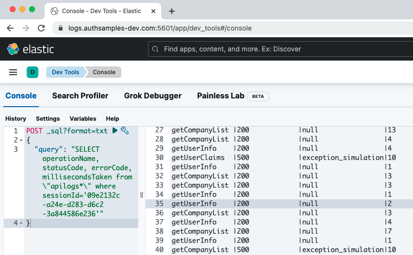

# Final Java Spring Boot API

[](https://www.codacy.com/gh/gary-archer/oauth.apisample.javaspringboot/dashboard?utm_source=github.com&amp;utm_medium=referral&amp;utm_content=gary-archer/oauth.apisample.javaspringboot&amp;utm_campaign=Badge_Grade)

[](https://snyk.io/test/github/gary-archer/oauth.apisample.javaspringboot?targetFile=build.gradle)

## Behaviour

The final OAuth secured Java API code sample, referenced in my blog at https://authguidance.com:

* The API takes finer control over OAuth domain specific claims and uses a certified JOSE library
* The API uses JSON request logging and Elasticsearch log aggregation, for measurability
* The API uses non-blocking code with request scoped ClaimsPrincipal / LogEntry objects

### API integrates with UI Clients

The API can run as part of an OAuth end-to-end setup, to serve my blog's UI code samples.\
Running the API in this manner forces it to be consumer focused to its clients:


### API can be Productively Tested

The API's clients are UIs, which get user level access tokens by running an OpenID Connect code flow.\
For productive test driven development, the API instead mocks the Authorization Server:


### API can be Load Tested

A basic load test uses Completable Futures to fire 5 parallel requests at a time at the API.\
This ensures no concurrency problems, and error rehearsal is used to verify that the API is supportable:


### API is Supportable

API logs can be analysed in use case based manner by running Elasticsearch SQL and Lucene queries.\
Follow the [Technical Support Queries](https://authguidance.com/2019/08/02/intelligent-api-platform-analysis/) for some people friendly examples:



## Commands

First ensure that a Java 17+ SDK is installed.

### Run the API

Then run the API in isolation with this command:

```bash
./start.sh
```

### Configure DNS and SSL

Configure DNS by adding these domains to your hosts file:

```text
127.0.0.1 localhost api.authsamples-dev.com login.authsamples-dev.com
```

Then call an endpoint over port 446:

```bash
curl -k https://api.authsamples-dev.com:446/api/companies
```

Configure SSL trust by running this command:

```bash
sudo "$JAVA_HOME/bin/keytool" -import -alias authsamples.ca -cacerts -file ./certs/authsamples-dev.ca.pem -storepass changeit -noprompt
```

### Test the API

Stop the API, then re-run it with a test configuration:

```bash
./testsetup.sh
```

Then run integration tests and a load test:

```bash
./gradlew test --rerun-tasks
./gradlew loadtest --rerun-tasks
```

## Further Details

* See the [Overview Page](https://authguidance.com/2019/03/24/java-spring-boot-api-overview/) for further details on running the API in end-to-end setups
* See the [OAuth Integration Page](https://authguidance.com/2019/03/24/java-spring-boot-api-coding-key-points/) for the security implementation
* See the [Non Functional Behaviour](https://authguidance.com/2017/10/08/corporate-code-sample-core-behavior/) page for a summary of overall qualities

## Programming Languages

* Java 17 and Spring Boot 3 are used to implement the REST API

## Infrastructure

* The Tomcat web server hosts the API over SSL
* AWS Cognito is used as the default Authorization Server
* The [jose4j library](https://bitbucket.org/b_c/jose4j/wiki/Home) is used to manage in memory validation of JWTs
* The API is designed for [Cloud Native Deployment](https://github.com/gary-archer/oauth.cloudnative.local) to Kubernetes
